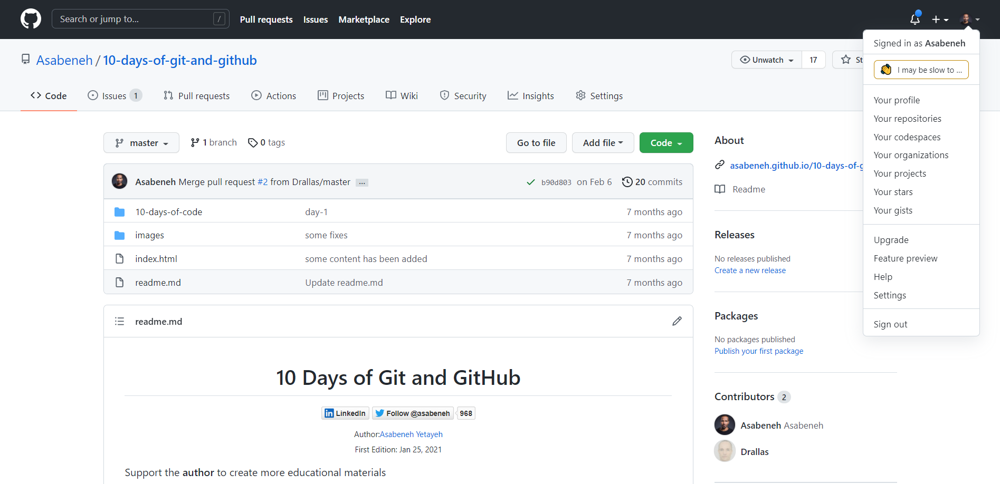

# Day 1

## Basic Command Lines

You should install [git](https://git-scm.com/).
<!-- https://github.com/yftorrezg/10-days-of-git-and-github/tree/fer -->
Mi repo en github [git_fer](https://github.com/yftorrezg/git-github/tree/main/10-days-of-git-and-github)
Mi repo mio en github [git-github_fer](https://github.com/yftorrezg/git-github)

```sh
$ pwd
/c/xampp/htdocs/fer/10-days-of-git-and-github/10-days-of-code
```

### Current working directory

```sh
Asabeneh@DESKTOP-KGC1AKC MINGW64 ~$ pwd
/c/Users/Asabeneh
```

### Navigating directory

```sh
Asabeneh@DESKTOP-KGC1AKC MINGW64 ~$ cd Desktop
Asabeneh@DESKTOP-KGC1AKC MINGW64 ~/Desktop
```

To check where you are at, use the _pwd_ command age

```sh
/Desktop$ pwd
/c/Users/Asabeneh/Desktop
```

### Making Directory

```sh
/Desktop$ mkdir 10-days-of-code
```

Now let's go to the 10-days-of-code folder using _cd_ command.

```sh
/Desktop$ cd 10-days-of-code
/Desktop/10-days-of-code
/Desktop/10-days-of-code$ pwd
/c/Users/Asabeneh/Desktop/10-days-of-code
```

### List files and directories

```sh
/Desktop/10-days-of-code$ ls
```

```sh
/Desktop/10-days-of-code$ mkdir day-1
```

```sh
/Desktop/10-days-of-code$ ls
day-1
```

Making **multiple** folders at once

```sh
/Desktop/10-days-of-code$ mkdir day-2 day-3 day-4 day-5 day-6 day-7 day-8 day-9 day-10
```

```sh
/Desktop/10-days-of-code
$ ls
day-1  day-10  day-2  day-3  day-4  day-5  day-6  day-7  day-8  day-9
```

### Detail list

_ls -la_.

```sh
/Desktop/10-days-of-code
$ ls -la
total 20
drwxr-xr-x 1 Asabeneh 197121 0 Jan 19 02:16 .
drwxr-xr-x 1 Asabeneh 197121 0 Jan 19 02:05 ..
drwxr-xr-x 1 Asabeneh 197121 0 Jan 19 02:12 day-1
drwxr-xr-x 1 Asabeneh 197121 0 Jan 19 02:16 day-10
drwxr-xr-x 1 Asabeneh 197121 0 Jan 19 02:16 day-2
drwxr-xr-x 1 Asabeneh 197121 0 Jan 19 02:16 day-3
drwxr-xr-x 1 Asabeneh 197121 0 Jan 19 02:16 day-4
drwxr-xr-x 1 Asabeneh 197121 0 Jan 19 02:16 day-5
drwxr-xr-x 1 Asabeneh 197121 0 Jan 19 02:16 day-6
drwxr-xr-x 1 Asabeneh 197121 0 Jan 19 02:16 day-7
drwxr-xr-x 1 Asabeneh 197121 0 Jan 19 02:16 day-8
drwxr-xr-x 1 Asabeneh 197121 0 Jan 19 02:16 day-9
```

### Creating file

We can use the _touch_ command to write a file.

```sh
/Desktop/10-days-of-code$ touch day-1.txt
/Desktop/10-days-of-code$ ls
day-1  day-1.txt  day-10  day-2  day-3  day-4  day-5  day-6  day-7  day-8  day-9
```

### Opening and writing on file

```sh
/Desktop/10-days-of-code$ nano day-1.txt
```


ctrl + x is to exit.


Now you can **save** the modified file by writing **Y** or you can cancel it by clicking **ctrl + c**.

After you write Y then click enter.

### Opening file to read

We can use the **_cat_** command just only to read the file.

```sh
/Desktop/10-days-of-code$ cat day-1.txt
This is my first text. I have never written on nano text editor before
```

### Copy file

Let's have day-1-backup.txt from day-1.txt by copying using the _cp_ command.

```sh
/Desktop/10-days-of-code
$ cp day-1.txt day-1-backup.txt

/Desktop/10-days-of-code $ ls
day-1  day-1.txt  day-10  day-1-backup.txt  day-2  day-3  day-4  day-5  day-6  day-7  day-8  day-9
```

### Rename file

```sh
/Desktop/10-days-of-code$ touch day-2.txt day-3.txt day-4.txt day-5.txt
/Desktop/10-days-of-code$ ls
day-1      day-10          day-2      day-3      day-4      day-5      day-6  day-8
day-1.txt  day-1-backup.txt  day-2.txt  day-3.txt  day-4.txt  day-5.txt  day-7  day-9
```

Now, let's rename the **day-2.txt** to **second-day.txt** using the **_mv_** command.

```sh
/Desktop/10-days-of-code$ mv day-2.txt second-day.txt

/Desktop/10-days-of-code$ ls
day-1      day-10          day-2  day-3.txt  day-4.txt  day-5.txt  day-7  day-9
day-1.txt  day-1-backup.txt  day-3  day-4      day-5      day-6      day-8  second-day.txt

```

Let's rename the **day-10** directory to **day-ten**.

```sh
/Desktop/10-days-of-code$ mv day-10 day-ten
/Desktop/10-days-of-code$ ls
day-1      day-1-backup.txt  day-3      day-4      day-5      day-6  day-8  day-ten
day-1.txt  day-2           day-3.txt  day-4.txt  day-5.txt  day-7  day-9  second-day.txt
```

### Moving file and directory

```sh
/Desktop/10-days-of-code$ mv day-1.txt day-1
/Desktop/10-days-of-code$ ls
day-1           day-2  day-3.txt  day-4.txt  day-5.txt  day-7  day-9    second-day.txt
day-1-backup.txt  day-3  day-4      day-5      day-6      day-8  day-ten
/Desktop/10-days-of-code$ cd day-1
/Desktop/10-days-of-code/day-1$ ls
day-1.txt
```

Let's try to move a file using the _cp_ command. Let's move the day-1-backup.txt to day-1 folder

```sh
/Desktop/10-days-of-git/10-days-of-code
$ cp day-1-backup.txt day-1

/Desktop/10-days-of-git/10-days-of-code
$ cd day-1
/Desktop/10-days-of-git/10-days-of-code/day-1
$ ls
day-1.txt  day-1-backup.txt

/Desktop/10-days-of-git/10-days-of-code/day-1
$ cd ..
/Desktop/10-days-of-git/10-days-of-code
$ ls
day-1             day-2  day-3.txt  day-4.txt  day-5.txt  day-7  day-9    second-day.txt
day-1-backup.txt  day-3  day-4      day-5      day-6      day-8  day-ten
```

The copied version of day-1-backup.txt moved to a day-1 folder.
Now let's create multiple backup files first and move them to a backup folder

```sh
/Desktop/10-days-of-code$ mkdir backups
/Desktop/10-days-of-code$ cd backups
/Desktop/10-days-of-code/backups$ touch day-2-backup.txt day-3-backup.txt
/Desktop/10-days-of-code/backups$ ls
day-2-backup.txt  day-3-backup.txt
```

Moving multiple files

```sh
/Desktop/10-days-of-code
$ mv -t backups day-1-backup.txt day-2-backup.txt  day-3-backup.txt
```

```sh
/Desktop/10-days-of-code
$ cd backups/
/Desktop/10-days-of-code/backups
$ ls
day-1-backup.txt  day-2-backup.txt  day-3-backup.txt
```

### Delete file and directory

Let's remove the file using the _rm_ command. Let's remove the day-1-backup.txt file from the day-1 folder.

```sh
/Desktop/10-days-of-code
$ cd day-1

/Desktop/10-days-of-code/day-1
$ ls
day-1.txt  day-1-backup.txt

/Desktop/10-days-of-code/day-1
$ rm  day-1-backup.txt

/Desktop/10-days-of-code/day-1$ ls
day-1.txt
```

Let's **delete** the **day-ten** folder using **_rmdir_** command. The **_rmdir_** delete a folder.

```sh
/Desktop/10-days-of-code
$ rmdir day-ten

/Desktop/10-days-of-code
$ ls
backups  day-2  day-3.txt  day-4.txt  day-5.txt  day-7  day-9
day-1    day-3  day-4      day-5      day-6      day-8  second-day.txt
```

Now, let's **copy** the backups folder to backups-2 and backup-3 using **_cp_** command. Then we will **delete** backups-3. The _cp_ with _-r_ has been used to copy it recursively.

```sh
/Desktop/10-days-of-code$ cp -r backups backups-2

/Desktop/10-days-of-code$ ls
backups    day-1  day-3      day-4      day-5      day-6  day-8  second-day.txt
backups-2  day-2  day-3.txt  day-4.txt  day-5.txt  day-7  day-9
```

Now let's do the above step to create backups-3

```sh
/Desktop/10-days-of-code$ cp -r backups backups-3
/Desktop/10-days-of-code
$ ls
backups    backups-3  day-2  day-3.txt  day-4.txt  day-5.txt  day-7  day-9
backups-2  day-1      day-3  day-4      day-5      day-6      day-8  second-day.txt
```

Now the backups-3 has files and neither the _rm_ nor the _rmdir_ deletes it. Therefore, we can use multiple commands to delete it. Let's try it with the following command.

```sh
/Desktop/10-days-of-code$ rm -rf backups-3
/Desktop/10-days-of-code$ ls
backups    day-1  day-3      day-4      day-5      day-6  day-8  second-day.txt
backups-2  day-2  day-3.txt  day-4.txt  day-5.txt  day-7  day-9
```

# Day 2

## Git and GitHub

### Install Git

  Install [git](https://git-scm.com/downloads)

### Configure your name and your email

```shell
git config --global user.name 'yourname'
git config --global user.email 'youremail'
```

### Create a local git repository

```shell
mkdir project_name
cd project_name
```

### Initialize Git

```shell
   git init
```

### Add file to the staging area

```shell
   git add filename
```

```shell
   git add filename1 filename2
```

To add all files and folders at once

```shell
   git add .
```

To add and commit at the same time

```sh
  git commit -am 'commit message'
```

### Unstage a file

```shell
    git reset HEAD filename
```

### Commit the changes

```shell
   git commit -m 'your message'
```

### Git log

The **_git lg_** command allows knowing the commit history of the project. It list down all the commit history

### Git check out

We can identify the commit id of each commit using the _git log_ command. Then we can make use of this id to retire any previous commit.

```sh
git checkout commit-id
```

### Creating a branch

- Only to create branch

```shell
    git branch  branch-name
```

- To create and checkout to the branch at the same time:

```shell
    git checkout -b branch-name
```

To switch between branches:

```shell
    git checkout main
    git checkout branch-name
```

To list down all the branches:

```shell
    git branch
```

### Create account on GitHub

  Sign up on [GitHub](https://github.com/)

### Create Repository on GitHub

Go to [GitHub](https://github.com/) and create a repository by click the plus icon on the top right corner.

### Connecting git with remote repository

```shell
    git remote add origin remote_repository_ul
```

### Push

```shell
    git push -u origin master
```

### Merge

```shell
    git checkout develop
    git merge feature
```

### Pull

```shell
    git checkout yourbranch
    git pull origin develop
```

```sh
    git checkout develop
    git merge yourbranch
    git push -u origin develop
```

### Git clone

```sh
~$ cd Desktop
~/Desktop$ git clone https://github.com/Asabeneh/10-days-of-git-and-github.git
```

### Rename Branch

To rename a current branch

```sh
git branch -m <newname>
```

To rename any branch

```sh
git branch -m <oldname> <newname>
```

### Deleting Branch

To delete a local branch

```sh
git branch -d branch-name
git branch -D branch-name
```

To delete remote branch

```sh
git push <remote_name> :<branch_name>
git push orgin: apuntesfer
```

or

```sh
git push <remote_name> --delete <branch_name>
```

### The .gitignore file

```sh
test
personal-data
example.txt
sensitive-info.txt
node_modules/
*.log 
```

### fork


After forking, we can clone the repository. We can send a pull request to the original repo to contribute.

## Git cheat sheet:

Here you have the basic git commands which might be useful:

```bash
git --version     # Check the version
git help          # Get help from git
git help commit   # Get help for the commit command
git config        # Get information about configuration
git config --list # Check all what is configured
git config --global user.name "username" # Configuring git user name
git config --global user.email "email"   # Configuring git user email

git init          # Initialize git repository local machine
git status        # Check changes or status of file(s) in repository

git add filename1.txt # Adding only one file
git add filename1.txt filename2.txt # Add multiple files
git add . # Add all the files and folders to the staging area

git commit -a # Stage and write a commit message in Nano
git commit -m "commit message" # Write a commit message after staging
git commit -am "commit message" # Grab everything & skip the stage process

git log  # See the history on the repository
git lg 😎
git log --author ="name" # To check change by specific user

git diff # Compare working copy in the repository
git diff --staged # Compare files in the staging area

git checkout -- filename # To get working copy back
git reset HEAD filename # Removes from the staging area / (unstage)
git checkout <branch-name> <path to file> # Checkout file from different branch
git checkout <commit-id> -- <path to file> # Checkout file from specific commit

git remote -v  # View remote repository-Urls
git remote add <remote name> repository-Url # Add a new remote
git push -u remote master # Push the file into github
git checkout <commit-id> -- filename #

git rm filename1 # Delete one tracked file
git mv filename1 filename2 # Delete tracked file(s)
git mv filename1 foldername/filename1 # Move file to a folder

git branch # to list branches
git branch branch-name # to create a branch
git checkout branch-name # to checkout to a certain branch
git checkout -b branch-name # to create a branch and checkout at the same time
git merge branch-name # to merge a branch to the current branch
```

# Day 3

## Git repository user interface features


Check what is available on your GitHub account settings

- watch this repository
- Give start to this repository
- fork this repository
- clone this repository



# Day 4

## GitHub page

ver tutorial en youtube ajajajja xD 😎
# Day 5

## Documenting on GitHub

## GitHub Markdown

Follow this [link](https://guides.github.com/features/mastering-markdown/) to learn about markdown

## GitHub wiki

Every GitHub public repository has a wiki page. A wiki page allows you to write or document.


# Day 6

## Collaborating on GitHub

1. First Fork the [10-days-of-git-and-github](https://github.com/Asabeneh/10-days-of-git-and-github) repository
2. After forking, clone this repository on your desktop
3. Add your favorite educational links on Education Resouces categories. You can learn how to collaborate by adding links of best educational resouces on the category below. If the category is not exist, you create a new category.

### Educational Resources

- [30 Days of JavaScript](https://github.com/Asabeneh/30-Days-Of-JavaScript)
- [30DaysOfReact](https://github.com/Asabeneh/30-Days-Of-React)
- [30 Days Of Python](https://github.com/Asabeneh/30-Days-Of-Python)
- [NumPy](https://github.com/Asabeneh/numpy)
- [Pandas](https://github.com/Asabeneh/pandas)
- [Data Visualization with Matplotlib](https://github.com/Asabeneh/matplotlib)